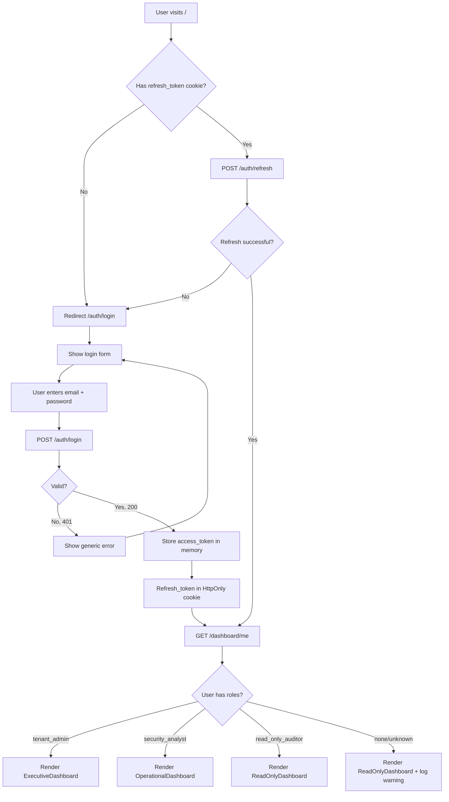
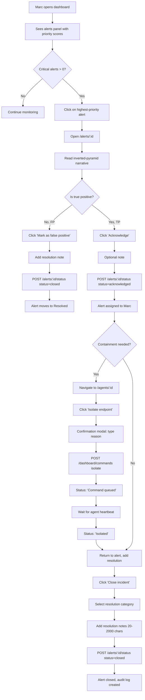
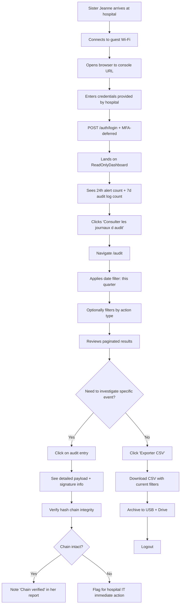
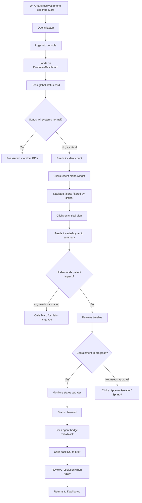
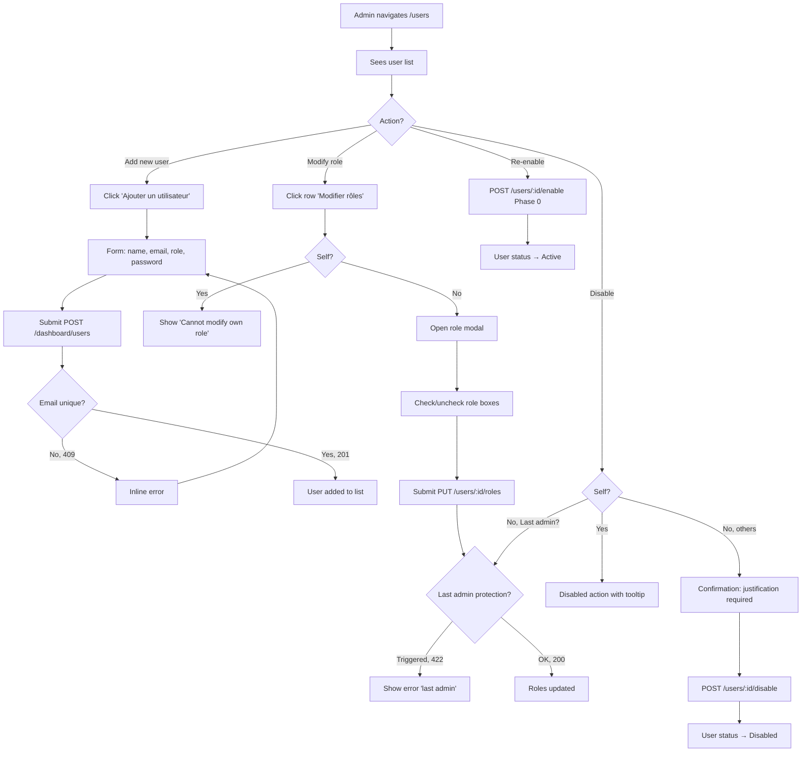
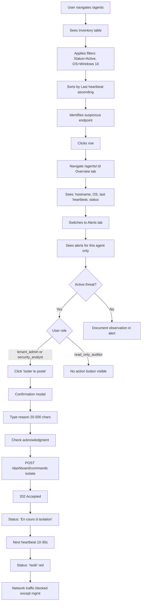

# RansomGuard-CM — Definition Phase, Day 4

**Document Type**: Information Architecture + User Flows + Task Flows + Wireflows
**Phase**: Definition (Master Plan Phase 2)
**Status**: Authoritative
**Author Role**: UX Architect / Information Architect (solo)
**Methodology Sources**:
- Peter Morville & Louis Rosenfeld — *Information Architecture for the World Wide Web* (4th ed., 2015)
- Donna Spencer — *Card Sorting: Designing Usable Categories* (2009)
- Nielsen Norman Group — *IA Heuristics* (Whitenton, 2017)
- Donna Spencer — *A Practical Guide to Information Architecture* (2010)
- Microsoft Defender XDR taxonomy (learn.microsoft.com/en-us/defender-xdr/)
- Material Design 3 — Navigation patterns (m3.material.io/components/navigation)

---

## Table of Contents

1. [Information Architecture — Sitemap & Navigation](#1-information-architecture--sitemap--navigation)
2. [User Flows — End-to-End Sequences](#2-user-flows--end-to-end-sequences)
3. [Task Flows — Atomic Workflows](#3-task-flows--atomic-workflows)
4. [Wireflows — Critical Path Visualizations](#4-wireflows--critical-path-visualizations)
5. [URL Structure & Deep Linking](#5-url-structure--deep-linking)
6. [Navigation Patterns & States](#6-navigation-patterns--states)

---

## 1. Information Architecture — Sitemap & Navigation

### Design Principles (Crue)

Per Morville's **7 facets of UX honeycomb** (semanticstudios.com/user_experience_design/), the IA must be:
- **Useful** — Maps to real user tasks (validated against journey map).
- **Usable** — Minimizes cognitive load (1-click access to top-3 tasks per role).
- **Findable** — Predictable taxonomy (mirrors industry conventions).
- **Accessible** — WCAG 2.2 AA conformant navigation.
- **Credible** — Aligns with Defender XDR / Kaspersky conventions users may already know.
- **Desirable** — Bilingual French-default, hospital-aesthetic.
- **Valuable** — Each L1 node directly serves an Ulwick desired outcome.

### L1 Navigation (Primary Top-Level)

Modeled on Defender XDR's taxonomy with adjustments for the 3-role model:

```
┌──────────────────────────────────────────────────────────────────┐
│  L1 NAVIGATION — Persistent Left Sidebar                          │
├──────────────────────────────────────────────────────────────────┤
│                                                                    │
│  📊  Tableau de bord       (Dashboard)                             │
│  🚨  Alertes               (Alerts)                                │
│  💻  Agents                (Agents)                                │
│  👥  Utilisateurs          (Users)              [admin only]       │
│  📜  Journal d'audit       (Audit log)          [admin + auditor]  │
│  ⚙️  Paramètres            (Settings)           [admin only]       │
│                                                                    │
└──────────────────────────────────────────────────────────────────┘
```

**Rationale per node:**

| Node | FR Label | EN Label | Maps to Discovery | RBAC |
|---|---|---|---|---|
| Dashboard | Tableau de bord | Dashboard | Admin#1, Analyst#1, Auditor#1 | All |
| Alerts | Alertes | Alerts | Analyst#1, Analyst#2 | All |
| Agents | Agents | Agents | Analyst#3, Analyst#10 | All |
| Users | Utilisateurs | Users | Admin#5 | tenant_admin |
| Audit log | Journal d'audit | Audit log | Auditor#2, Auditor#6, Admin#4 | admin + auditor |
| Settings | Paramètres | Settings | (Sprint 8+) | tenant_admin |

### L2 Navigation (Per Section)

#### L2 — Dashboard

```
Dashboard
├── Vue exécutive            (default for tenant_admin)
├── Vue opérationnelle       (default for security_analyst)
└── Vue lecture seule        (default for read_only_auditor)
```

Single page, **role-based component swap** at render time. URL stays `/dashboard`.

#### L2 — Alertes

```
Alertes
├── File d'attente           (Queue — default, sorted by priority score)
│   ├── filter: Sévérité     [Critique, Haut, Moyen, Faible, Info]
│   ├── filter: Statut       [Nouveau, En cours, Résolu]
│   ├── filter: Module       [SENTINEL, ENTROPY, GENEALOGY, USB GUARD, EXFIL WATCH, IRONCLAD]
│   ├── filter: Période      [Dernière heure, 24h, 7 jours, 30 jours, Personnalisé]
│   └── filter: Agent         (text search by hostname)
│
├── Mes alertes assignées    (My assigned — for analyst self-tracking)
├── Résolues                  (Resolved — sortable, exportable)
└── /alerts/:id               (Detail page — modal-overlay or full-route)
    ├── Vue d'ensemble        (Overview tab)
    ├── Chronologie           (Timeline tab)
    ├── Artefacts             (Artifacts tab — files, processes, network)
    └── Actions               (Actions tab — history of status changes)
```

#### L2 — Agents

```
Agents
├── Inventaire                (Default list view)
│   ├── filter: Statut        [Actif, Hors ligne, Isolé, Désactivé]
│   ├── filter: OS            [Windows 7, 10, 11]
│   ├── filter: Heartbeat     [< 5 min, 5-60 min, > 60 min]
│   └── filter: Groupe        [Service: Pédiatrie, Cardio, Imagerie, Admin, ...]
│
└── /agents/:id               (Detail)
    ├── Vue d'ensemble        (Overview tab)
    ├── Modules               (Modules status tab)
    ├── Heartbeats            (History tab)
    ├── Alertes               (Filtered alerts for this agent)
    └── Politiques            (Applied policies)
```

#### L2 — Utilisateurs (admin only)

```
Utilisateurs
├── Liste                     (Default)
│   ├── filter: Statut        [Actif, Désactivé]
│   ├── filter: Rôle          [tenant_admin, security_analyst, read_only_auditor]
│   └── search by email/name
│
├── /users/new                (Create user — modal or dedicated route)
└── /users/:id                (Detail)
    ├── Informations          (Profile)
    ├── Rôles                 (Role management)
    └── Activité              (Audit log filtered by this user)
```

#### L2 — Journal d'audit (admin + auditor)

```
Journal d'audit
├── Recherche                 (Search + filter, paginated)
│   ├── filter: Période       [Today, 7d, 30d, 90d, Custom]
│   ├── filter: Type d'action [login, logout, alert_status_change, user_*, command_*, ...]
│   ├── filter: Utilisateur   [dropdown of users in tenant]
│   └── full-text search
│
└── Exporter                  (Export to CSV — current filter state)
```

### Global Header

```
┌────────────────────────────────────────────────────────────────────┐
│  [LOGO RGCM]  [Tenant: Hôpital Régional de Yaoundé]  🔔 [🌐 FR|EN]  │
│                                                       👤 Marc T. ▼  │
└────────────────────────────────────────────────────────────────────┘
```

**Components:**
- Logo (left, clicks → home)
- Tenant context badge (read-only display of current tenant)
- Notification bell (top-right, unread count badge)
- Language switcher FR | EN (right of bell)
- User menu (right-most): name + avatar → dropdown (Profil, Déconnexion)

### Global Footer

Minimal: version number + status indicator (online/offline) + link to documentation.

### Mobile Behavior (320-768 px)

- L1 sidebar collapses to hamburger menu
- Header keeps logo + hamburger + language + user menu
- All other interactions remain functional (no mobile-only features)
- Touch targets ≥ 44×44 px (per WCAG 2.5.5 + iOS HIG)

### Card-Sort Inspiration (Hypothetical)

Per Morville's IA practice, the categories above were derived by:
1. Listing all 22 User Stories from PRD v2
2. Grouping by primary task object (alerts, agents, users, etc.)
3. Mapping to RBAC permission (drives visibility)
4. Cross-checking against Defender / Kaspersky / SentinelOne L1 nav

A formal closed card-sort with users (Optimal Workshop, Treejack) is a **post-soutenance validation step** (Chapter 5 future work).

---

## 2. User Flows — End-to-End Sequences

### Methodology Notes

Per Spencer (*A Practical Guide to IA*, 2010): user flows show **the path a user takes to complete a meaningful goal**, including decision points and alternative paths. They are sequencing-focused (not screen-focused like wireflows).

### Flow F1 — First-Time Login (any role)



**Decision points:**
- Cookie presence → silent refresh attempt
- Refresh validity → auto-login or redirect to form
- Role assignment → role-based landing
- Auth failure → generic message (no enumeration)

### Flow F2 — Alert Triage (security_analyst)



### Flow F3 — Compliance Review (read_only_auditor)



### Flow F4 — Executive Review & Approval (tenant_admin)



### Flow F5 — User Management (tenant_admin)



### Flow F6 — Agent Inventory & Containment (security_analyst + tenant_admin)



---

## 3. Task Flows — Atomic Workflows

### Methodology Notes

Task flows are **atomic** (a single goal, no major branching) and **screen-by-screen** specific. They feed wireframes directly.

### Task T1 — "Acknowledge an Alert"

**User:** security_analyst
**Goal:** Move an alert from "Nouveau" to "En cours"
**Pre-condition:** User authenticated, alert exists with status="new"

```
1. [Alerts List] Click row of target alert
2. [Alert Detail] Read header (severity, agent, age)
3. [Alert Detail] Read narrative summary
4. [Alert Detail] Click "Prendre en charge" button (Acknowledge)
5. [Modal] Optional note field (0-500 chars)
6. [Modal] Click "Confirmer"
7. [API] POST /dashboard/alerts/:id/status {status: "acknowledged", note?}
8. [Optimistic UI] Status badge → "En cours" immediately
9. [On Success] Toast "Alerte prise en charge"
10. [On Failure] Revert badge, toast error
11. [Alert Detail] Timeline shows acknowledgment event
12. [Alert Detail] Action buttons update: "Fermer" now visible, "Prendre en charge" hidden
```

### Task T2 — "Close an Alert with Resolution"

**User:** security_analyst (or tenant_admin)
**Goal:** Move alert from "En cours" to "Résolu"
**Pre-condition:** Alert status="acknowledged"

```
1. [Alert Detail] Click "Fermer" button
2. [Modal] Select resolution category dropdown:
    - Faux positif
    - Vrai positif — Contenu
    - Vrai positif — Escaladé
    - Non concluant
3. [Modal] Resolution notes textarea (required, 20-2000 chars, char count visible)
4. [Modal] Submit
5. [Validation] Client-side: notes length check
6. [API] POST /dashboard/alerts/:id/status {status: "closed", note: "<category>: <notes>"}
7. [On Success] Modal closes, badge → "Résolu" gray
8. [Alert Detail] All action buttons hidden, notes visible in timeline
9. [Alert Detail] Audit log entry created with actor_user_id
```

### Task T3 — "Isolate an Endpoint"

**User:** tenant_admin (or security_analyst)
**Goal:** Cut network access of compromised endpoint
**Pre-condition:** Agent status="active", user role allows command

```
1. [Agent Detail] Click "Isoler le poste" (Isolate endpoint)
2. [Modal] Warning text in red
3. [Modal] Reason textarea (required, 20-500 chars)
4. [Modal] Checkbox: "Je comprends que cela va déconnecter le poste"
5. [Modal] Submit button disabled until checkbox checked AND reason valid
6. [Modal] Click "Confirmer l'isolation"
7. [API] POST /dashboard/commands {agent_id, command_type: "isolate", payload: {reason}}
8. [On 202] Toast "Commande mise en file d'attente"
9. [Agent Detail] Status: "Isolation en cours" (yellow)
10. [Polling] Every 10s, refetch agent status
11. [On status change] Status: "Isolé" (red border)
12. [Audit] Entry "endpoint_isolated" logged
```

### Task T4 — "Generate ANTIC Compliance Report" (Sprint 8 placeholder)

**User:** tenant_admin
**Goal:** Produce signed PDF for quarterly inspection
**Status in Sprint 7:** Placeholder button + "Coming Sprint 8" message
**Why deferred:** No ComplianceReport model in backend (audit confirmed)

```
[Sprint 7 placeholder behavior:]
1. [Dashboard] Click "Télécharger le rapport trimestriel"
2. [Modal] Inform "Cette fonctionnalité sera disponible dans Sprint 8"
3. [Modal] Show roadmap link or contact email
```

### Task T5 — "Search Audit Logs"

**User:** tenant_admin or read_only_auditor
**Goal:** Find specific past event

```
1. [Audit Log] Navigate /audit
2. [Audit Log] Click date picker → select range
3. [Audit Log] Click action type filter → select 1+ types
4. [Audit Log] Optionally type search query (debounce 300ms)
5. [API] GET /dashboard/audit-logs?from&to&action&search&page=1
6. [Table] Render paginated results
7. [Pagination] Click "Suivant" to load next page
8. [Row Click] Optional expansion to see full payload
9. [Export] Click "Exporter CSV" → client-side CSV generation from current results
```

### Task T6 — "Add a New User"

**User:** tenant_admin
**Goal:** Provision an account for a new colleague

```
1. [Users List] Click "Ajouter un utilisateur"
2. [Form] Fill full name, email
3. [Form] Select role from dropdown (3 options)
4. [Form] Set initial password + confirm
5. [Strength Indicator] Real-time validation
6. [Form] Click "Créer"
7. [Validation] Client-side: email format, password policy
8. [API] POST /dashboard/users
9. [On 409] Inline "Cet email existe déjà"
10. [On 201] Toast "Utilisateur créé", new row in list
11. [Future Sprint 8] Send invitation email
```

---

## 4. Wireflows — Critical Path Visualizations

### Methodology Notes

A wireflow combines a low-fi wireframe with a flow diagram, showing **screens AND transitions together**. NN/g recommends wireflows for "experiences where screen design and flow are equally important" (nngroup.com/articles/wireflows). For Sprint 7 we produce ASCII wireflows; Figma wireframes will follow in Design Phase.

### Wireflow WF1 — Login → Role-Based Landing

```
╔════════════════════════════════════════╗
║  /auth/login                            ║
║                                          ║
║  ┌──────────────────────────────────┐  ║
║  │  🛡 RansomGuard-CM                │  ║
║  │  Connexion                        │  ║
║  │                                    │  ║
║  │  Email                             │  ║
║  │  ┌────────────────────────────┐  │  ║
║  │  │                              │  │  ║
║  │  └────────────────────────────┘  │  ║
║  │                                    │  ║
║  │  Mot de passe                      │  ║
║  │  ┌────────────────────────────┐  │  ║
║  │  │                              │  │  ║
║  │  └────────────────────────────┘  │  ║
║  │                                    │  ║
║  │  ┌─────────────────────────┐      │  ║
║  │  │   Se connecter           │      │  ║
║  │  └─────────────────────────┘      │  ║
║  │                                    │  ║
║  │  🌐 FR | EN                        │  ║
║  └──────────────────────────────────┘  ║
╚════════════════════════════════════════╝
              ↓ Submit
         Validate credentials
              ↓
   ┌──────────┴──────────┐
   ↓ Invalid (401)        ↓ Valid (200)
[Toast generic error]   [GET /dashboard/me]
   ↓                      ↓
[Stay on /login]    [Determine role + redirect]
                          ↓
   ┌─────────────────────┼──────────────────────┐
   ↓ tenant_admin         ↓ security_analyst    ↓ read_only_auditor
[/dashboard render    [/dashboard render     [/dashboard render
 ExecutiveDashboard]   OperationalDashboard]  ReadOnlyDashboard]
```

### Wireflow WF2 — Alert Triage (Marc's Critical Path)

```
╔════════════════════════════════════════════════════╗
║  /dashboard (security_analyst)                       ║
║  ┌──────────────────────────────────────────────┐  ║
║  │ [Sidebar L1]              [Header: Marc, FR]  │  ║
║  │ 📊 Dashboard      ┌──────────────────────┐    │  ║
║  │ 🚨 Alertes [3]    │ Agents en ligne: 42   │    │  ║
║  │ 💻 Agents          │ Hors ligne: 2          │    │  ║
║  │ 📜 Audit log      │ Avec avertissements: 3 │    │  ║
║  │                    └──────────────────────┘    │  ║
║  │                                                  │  ║
║  │ FLUX D'ALERTES TEMPS RÉEL                       │  ║
║  │ ┌──────────────────────────────────────────┐   │  ║
║  │ │ [92] 🔴 CRITIQUE  PEDIATRIE-02   SENTINEL│   │  ║
║  │ │      Chiffrement détecté il y a 14s      │   │  ║
║  │ │ ─────────────────────────────────────────│   │  ║
║  │ │ [47] 🟠 MOYEN     CARDIO-05      ENTROPY │   │  ║
║  │ │      Activité suspecte il y a 4 min      │   │  ║
║  │ └──────────────────────────────────────────┘   │  ║
║  └──────────────────────────────────────────────┘  ║
╚════════════════════════════════════════════════════╝
                          ↓ Click critical alert
╔════════════════════════════════════════════════════╗
║  /alerts/:id                                         ║
║  ┌──────────────────────────────────────────────┐  ║
║  │ ← Retour aux alertes                          │  ║
║  │                                                 │  ║
║  │ Alert #92  [CRITIQUE 92]  [NOUVEAU]            │  ║
║  │ Détecté il y a 23s · PEDIATRIE-02              │  ║
║  │                                                 │  ║
║  │ ─── RÉSUMÉ (inverted pyramid) ───              │  ║
║  │ Le module SENTINEL a détecté qu'un fichier      │  ║
║  │ canary a été modifié par powershell.exe         │  ║
║  │ (PID 4892) avec une entropie de 7.92 sur 12     │  ║
║  │ fichiers en 4 secondes. Cela indique un         │  ║
║  │ chiffrement actif de fichiers.                   │  ║
║  │                                                 │  ║
║  │ ┌────────────────────────┐ ┌──────────────┐   │  ║
║  │ │  Prendre en charge      │ │ Marquer FP   │   │  ║
║  │ └────────────────────────┘ └──────────────┘   │  ║
║  │                                                 │  ║
║  │ ▼ Détails techniques (expand)                   │  ║
║  │ ▼ Chronologie                                   │  ║
║  │ ▼ Artefacts (12 fichiers, 3 processus)         │  ║
║  └──────────────────────────────────────────────┘  ║
╚════════════════════════════════════════════════════╝
                ↓ Click "Prendre en charge"
╔════════════════════════════════════════════════════╗
║  Modal: Acknowledge Alert                            ║
║  ┌──────────────────────────────────────────────┐  ║
║  │ Prendre en charge cette alerte ?              │  ║
║  │                                                 │  ║
║  │ Vous allez vous assigner cette alerte.         │  ║
║  │                                                 │  ║
║  │ Note (facultative)                             │  ║
║  │ ┌────────────────────────────────────────┐    │  ║
║  │ │ Investigation en cours...               │    │  ║
║  │ └────────────────────────────────────────┘    │  ║
║  │                                                 │  ║
║  │           [Annuler]  [Confirmer]               │  ║
║  └──────────────────────────────────────────────┘  ║
╚════════════════════════════════════════════════════╝
                ↓ Confirm
   POST /alerts/:id/status {status: "acknowledged", note}
                ↓ 200
   [Optimistic UI: status → EN COURS]
                ↓
   [Now visible: "Fermer" and "Isoler le poste" buttons]
```

### Wireflow WF3 — Endpoint Isolation (Marc's Containment Action)

```
[From Alert Detail or Agent Detail]
                ↓ Click "Isoler le poste"
╔════════════════════════════════════════════════════╗
║  Modal: Confirm Isolation                            ║
║  ┌──────────────────────────────────────────────┐  ║
║  │ ⚠️  Isoler PEDIATRIE-02 du réseau ?          │  ║
║  │                                                 │  ║
║  │ Cette action déconnectera immédiatement       │  ║
║  │ ce poste de tous les services réseau,         │  ║
║  │ à l'exception de la console de gestion.       │  ║
║  │                                                 │  ║
║  │ Raison (obligatoire, 20-500 caractères)        │  ║
║  │ ┌────────────────────────────────────────┐    │  ║
║  │ │ Activité ransomware détectée par        │    │  ║
║  │ │ SENTINEL — endpoint isolé pour          │    │  ║
║  │ │ confinement immédiat                    │    │  ║
║  │ └────────────────────────────────────────┘    │  ║
║  │                                       127 / 500│  ║
║  │                                                 │  ║
║  │ ☑ Je comprends que cela va déconnecter        │  ║
║  │   le poste                                     │  ║
║  │                                                 │  ║
║  │           [Annuler]  [Isoler]                  │  ║
║  └──────────────────────────────────────────────┘  ║
╚════════════════════════════════════════════════════╝
                ↓ Confirm (button enabled only when checkbox checked AND reason ≥ 20 chars)
   POST /dashboard/commands {agent_id, command_type: "isolate", payload: {reason}}
                ↓ 202 Accepted
   [Toast: "Commande mise en file d'attente"]
                ↓
╔════════════════════════════════════════════════════╗
║  /agents/:id — status now "Isolation en cours"      ║
║  ┌──────────────────────────────────────────────┐  ║
║  │ PEDIATRIE-02  🟡 Isolation en cours...        │  ║
║  │ Commande envoyée il y a 8s                    │  ║
║  │ Prochain heartbeat estimé dans ~22s           │  ║
║  │ ⟳ Actualisation automatique toutes les 10s   │  ║
║  └──────────────────────────────────────────────┘  ║
╚════════════════════════════════════════════════════╝
                ↓ After next heartbeat (30s typical)
╔════════════════════════════════════════════════════╗
║  /agents/:id — status now "Isolé"                   ║
║  ┌──────────────────────────────────────────────┐  ║
║  │ PEDIATRIE-02  🔴 Isolé                         │  ║
║  │ Isolé depuis 42s                              │  ║
║  │ Trafic réseau bloqué sauf gestion             │  ║
║  │ ┌──────────────────────────────────┐         │  ║
║  │ │ Restaurer l'accès réseau          │         │  ║
║  │ └──────────────────────────────────┘         │  ║
║  └──────────────────────────────────────────────┘  ║
╚════════════════════════════════════════════════════╝
```

---

## 5. URL Structure & Deep Linking

### Conventions

- **kebab-case** for multi-word paths
- **Singular** for detail (`/alerts/:id`, not `/alert/:id`)
- **Plural** for collections (`/alerts`, `/agents`)
- **Query params** for filters and pagination (shareable links)
- **Hash fragments** for tabs (`/alerts/:id#timeline`)

### Route Map

| Route | Page | Roles | Tab fragments |
|---|---|---|---|
| `/` | Redirect → /dashboard | All | — |
| `/auth/login` | LoginPage | Public | — |
| `/auth/logout` | (Action, not route) | All | — |
| `/dashboard` | DashboardPage (role-swap) | All | — |
| `/alerts` | AlertsListPage | All | — |
| `/alerts?severity=critical&status=new` | AlertsListPage (filtered) | All | — |
| `/alerts/:id` | AlertDetailPage | All | `#overview` `#timeline` `#artifacts` `#actions` |
| `/agents` | AgentsListPage | All | — |
| `/agents/:id` | AgentDetailPage | All | `#overview` `#modules` `#heartbeats` `#alerts` `#policies` |
| `/users` | UsersListPage | admin | — |
| `/users/:id` | UserDetailPage (Sprint 8) | admin | `#profile` `#roles` `#activity` |
| `/audit` | AuditLogsPage | admin + auditor | — |
| `/settings` | (Sprint 8) | admin | — |

### Deep Link Examples

```
https://rgcm.hopital.cm/alerts?severity=critical&from=2026-06-01
https://rgcm.hopital.cm/alerts/abc-123#timeline
https://rgcm.hopital.cm/agents?status=isolated
https://rgcm.hopital.cm/audit?action=alert_status_change&user=marc-id&from=2026-06-01&to=2026-06-30
```

### Query Param Spec

| Param | Format | Default | Routes |
|---|---|---|---|
| `page` | Integer ≥ 1 | 1 | All list pages |
| `page_size` | Integer (10\|25\|50\|100) | 50 | All list pages |
| `from` | ISO 8601 date | (none) | `/alerts`, `/audit` |
| `to` | ISO 8601 date | (none) | `/alerts`, `/audit` |
| `severity` | enum | (none) | `/alerts` |
| `status` | enum | (none) | `/alerts`, `/agents` |
| `module` | enum | (none) | `/alerts` |
| `os` | enum | (none) | `/agents` |
| `heartbeat_age` | enum (recent\|stale\|offline) | (none) | `/agents` |
| `search` | text | (none) | `/alerts`, `/agents`, `/audit`, `/users` |
| `action` | enum or csv | (none) | `/audit` |
| `actor` | user_id | (none) | `/audit` |

### Browser History Behavior

- Filters push to history (`pushState`) — back button restores previous filter
- Modals do NOT push to history (don't pollute history with confirmation dialogs)
- Tab switches within detail pages: `replaceState` (don't fill history)

---

## 6. Navigation Patterns & States

### Sidebar L1 States

```
┌─────────────────┐  ┌─────────────────┐  ┌─────────────────┐
│ Default          │  │ Active           │  │ Disabled (RBAC)  │
│ ─────────────── │  │ ─────────────── │  │ ─────────────── │
│ 📊 Dashboard    │  │ 📊 Dashboard    │  │ 📊 Dashboard    │
│ 🚨 Alertes  [3] │  │ 🚨 Alertes  [3] │  │ 🚨 Alertes  [3] │
│ 💻 Agents       │  │ 💻 Agents       │  │ 💻 Agents       │
│ 👥 Utilisateurs │  │ 👥 Utilisateurs │  │ 👥 (hidden)     │
│ 📜 Audit        │  │ 📜 Audit        │  │ 📜 Audit        │
└─────────────────┘  └─────────────────┘  └─────────────────┘
                       (highlighted bar)    (RBAC-filtered)
```

### Badge / Counter States

- New alerts count = visible badge with count, red if any critical
- Notification bell = unread count, with priority color
- Agent offline = count badge on Agents L1

### Empty States

Per NN/g (Sherwin, "Empty States" article), empty states must:
1. Confirm what's been searched/filtered
2. Suggest a next action
3. Optionally illustrate or motivate

```
┌──────────────────────────────────────────────────────┐
│           [Illustration: shield with checkmark]       │
│                                                        │
│           Aucune alerte ne correspond à vos filtres   │
│                                                        │
│      Essayez d'élargir votre recherche ou de         │
│      réinitialiser les filtres ci-dessus.            │
│                                                        │
│              [ Réinitialiser les filtres ]            │
└──────────────────────────────────────────────────────┘
```

### Loading States

- **Initial page load:** Skeleton screens (per Material Design 3)
- **Mutation (action button click):** Spinner inside button + button disabled
- **Background refetch (TanStack Query):** Subtle indicator (small spinner top-right of card), not full skeleton
- **Offline detected:** Banner top of page "Connexion perdue. Dernière mise à jour il y a X min."

### Error States

- **Network error:** Toast (non-blocking) + retry button
- **403 RBAC:** Redirect to /dashboard + toast "Accès refusé"
- **404:** Dedicated 404 page with link back to dashboard
- **500:** Friendly error page + Sentry-captured error reference
- **Form validation:** Inline error below field

---

**End of Definition Day 4 — Information Architecture, User Flows, Task Flows, Wireflows**

**Next**: Definition Day 5 — STRIDE Web Tier Update, CSP Spec, Privacy DPIA, Data Inventory.
